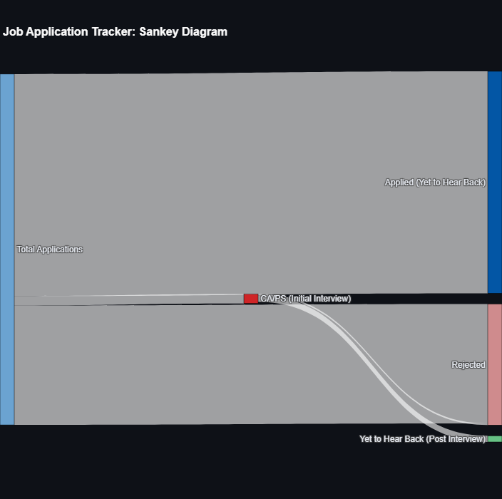

# Job Application Tracker Dashboard

## Overview
This project provides an interactive dashboard to track job applications, visualize progress, and analyze outcomes. It uses Python with Streamlit for the frontend and Plotly for data visualization.

## Features
- **Sankey Diagram**: Visualizes the flow of job applications from submission to outcomes.
- **Application Trends Over Time**: Highlights how your application activity changes over time.
- **Outcome Distribution**: Displays the proportion of rejections, interviews, and pending responses.
- **Applications by Company**: Shows which companies received the most applications.

## Visualizations
### Sankey Diagram



## How to Run the Dashboard
1. Clone this repository:
   ```bash
   git clone https://github.com/victoria406/jobSearch4Recruiters.git
